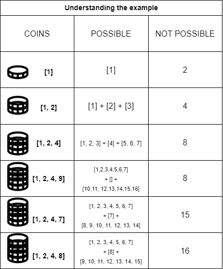

# 💸 Understanting Challenge Three with an example
Let's Imagine I sort all my coins in ascending order, and I start building a new set of coins taking them in my hand one-by-one

## Consider the following statements...
* The *POSSIBLE* changes are separated in three groups: 
    1) The ones that were able to be created from my actual (the previous) set of coins
    2) The change that I can give back with only the coin I am inserting in the set 
    3) Since I am inserting a new coin, I can give back the change of the previous set of coins plus the new coin
* When inserting a new coin:
    1) I **can't** add a coin **greater** than the *NOT POSSIBLE* change, since I will still not be able to give back that change.
    2) I **can** add a coin **equal** to the *NOT POSSIBLE* change, since I will be able to give back that change (giving back the coin I just inserted)
    3) I **can** add a coin **lesser** than the *NOT POSSIBLE* change, since I will be able to give back that change with a combination of the coin I am adding and one of the previous combinations
* If I indeed am able to insert that coin, the new *NOT POSSIBLE* chenge will be the `previous one plus the coin I just inserted`, since I would be able to give back all the previous changes plus the new coin
